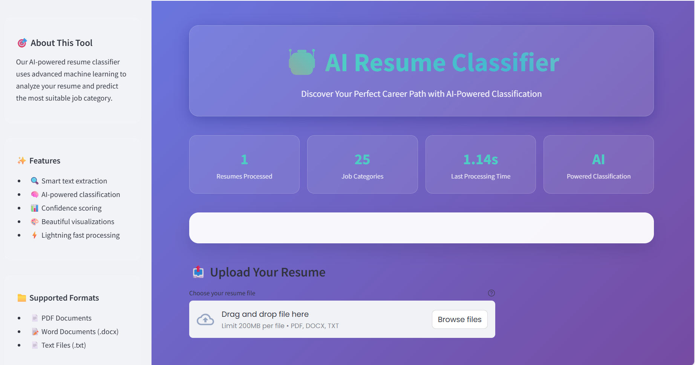
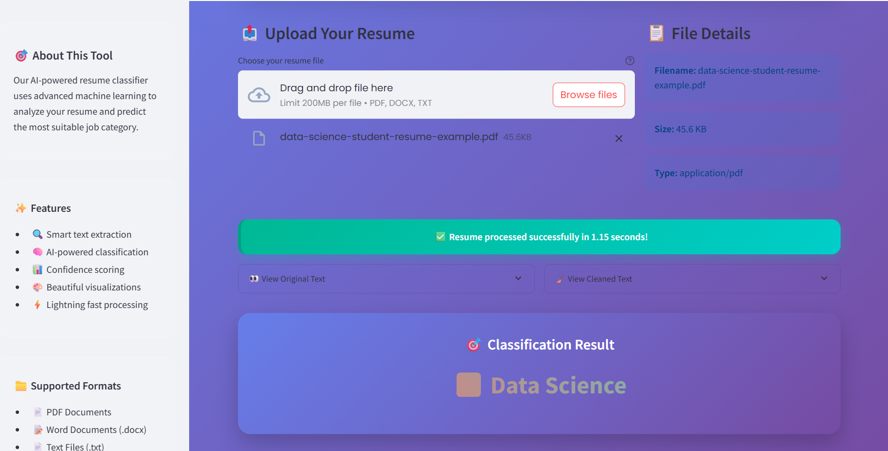
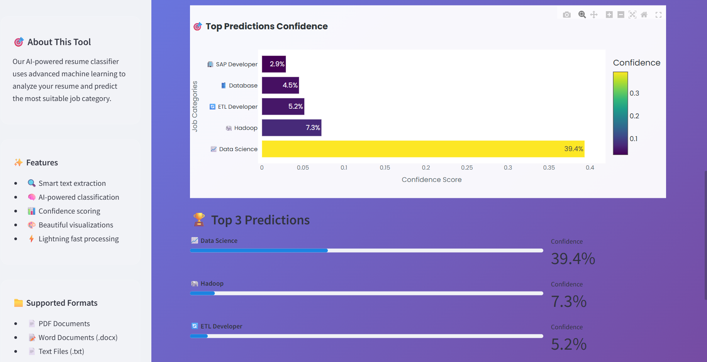

# 🤖 AI Resume Classifier


> **Discover Your Perfect Career Path with AI-Powered Classification**

An intelligent resume classification system that uses machine learning to analyze resumes and predict the most suitable job categories. Built with a beautiful, modern interface using Streamlit.

## 🌟 Features

- **🔍 Smart Text Extraction**: Supports PDF, DOCX, and TXT file formats
- **🧠 AI-Powered Classification**: Uses TF-IDF vectorization and Logistic Regression
- **📊 Confidence Scoring**: Shows prediction confidence with interactive charts
- **🎨 Beautiful UI**: Modern glassmorphism design with animations
- **⚡ Lightning Fast**: Processes resumes in under 2 seconds
- **📈 25 Job Categories**: Comprehensive classification across various industries

## 🎯 Supported Job Categories

- ⚖️ Advocate
- 🎨 Arts
- 🔧 Automation Testing
- ⛓️ Blockchain
- 📊 Business Analyst
- 🏗️ Civil Engineer
- 📈 Data Science
- 🛢️ Database
- 🔄 DevOps Engineer
- 💻 DotNet Developer
- 🔄 ETL Developer
- ⚡ Electrical Engineering
- 👥 HR
- 🐘 Hadoop
- 💪 Health and Fitness
- ☕ Java Developer
- ⚙️ Mechanical Engineer
- 🔒 Network Security Engineer
- 📋 Operations Manager
- 📈 PMO
- 🐍 Python Developer
- 🏢 SAP Developer
- 💼 Sales
- 🧪 Testing
- 🌐 Web Designing

## 🚀 Quick Start

### Prerequisites

Make sure you have Python 3.8+ installed on your system.

### Installation

1. **Clone the repository**
   ```bash
   git clone https://github.com/IshanNaikele/Resume-Analyzer-new.git
   cd Resume-Analyzer-new
   ```

2. **Install dependencies**
   ```bash
   pip install -r requirements.txt
   ```

3. **Download NLTK data** (if not automatically downloaded)
   ```python
   import nltk
   nltk.download('punkt')
   nltk.download('stopwords')
   nltk.download('wordnet')
   ```

4. **Ensure model files are present**
   - Place `log_model.pkl` and `tfidf.pkl` in the project directory
   - These files contain the pre-trained model and vectorizer

5. **Run the application**
   ```bash
   streamlit run app.py
   ```

6. **Open your browser**
   - Navigate to `http://localhost:8501`
   - Start classifying resumes!

## 📦 Dependencies

```txt
streamlit>=1.28.0
scikit-learn>=1.3.0
nltk>=3.8
pandas>=1.5.0
plotly>=5.15.0
python-docx>=0.8.11
PyPDF2>=3.0.0
pickle-mixin>=1.0.2
```

## 🏗️ Project Structure

```
Resume-Analyzer-new/
│
├── app.py                 # Main Streamlit application
├── log_model.pkl         # Pre-trained logistic regression model
├── tfidf.pkl            # TF-IDF vectorizer
├── requirements.txt      # Python dependencies
├── README.md            # Project documentation
├── .gitignore          # Git ignore file
└── assets/             # Static assets (if any)
    └── screenshots/    # Application screenshots
```

## 🔧 How It Works

1. **Text Extraction**: The app extracts text from uploaded resume files (PDF, DOCX, TXT)
2. **Text Preprocessing**: 
   - Converts to lowercase
   - Removes URLs, mentions, hashtags
   - Removes special characters and non-ASCII
   - Lemmatizes words and removes stopwords
3. **Vectorization**: Uses TF-IDF to convert text to numerical features
4. **Classification**: Logistic regression model predicts the job category
5. **Results**: Displays prediction with confidence scores and interactive charts

## 📊 Model Performance

- **Dataset**: Trained on 962+ professional resumes
- **Algorithm**: Logistic Regression with TF-IDF vectorization
- **Categories**: 25 distinct job categories
- **Features**: Advanced text preprocessing and feature engineering

## 🎨 UI Features

- **Modern Design**: Glassmorphism effects with gradient backgrounds
- **Responsive Layout**: Works on desktop and mobile devices
- **Interactive Charts**: Plotly-powered confidence visualization
- **Real-time Processing**: Live updates and progress indicators
- **Statistics Dashboard**: Track processing metrics

## 📱 Usage

1. **Upload Resume**: Drag and drop or browse for your resume file
2. **Processing**: The AI automatically extracts and analyzes the text
3. **Results**: View the predicted job category with confidence scores
4. **Analysis**: Explore detailed confidence breakdowns and top predictions

## 🤝 Contributing

We welcome contributions! Here's how you can help:

1. **Fork the repository**
2. **Create a feature branch** (`git checkout -b feature/AmazingFeature`)
3. **Commit your changes** (`git commit -m 'Add some AmazingFeature'`)
4. **Push to the branch** (`git push origin feature/AmazingFeature`)
5. **Open a Pull Request**

### Areas for Contribution

- 🔍 Add support for more file formats
- 🧠 Improve the ML model accuracy
- 🎨 Enhance the UI/UX design
- 📊 Add more visualization features
- 🌐 Add multilingual support
- 🔧 Performance optimizations

## 📝 License

This project is licensed under the MIT License - see the [LICENSE](LICENSE) file for details.

## 🙏 Acknowledgments

- **Streamlit** for the amazing web app framework
- **scikit-learn** for machine learning tools
- **NLTK** for natural language processing
- **Plotly** for interactive visualizations
- **Google Fonts** for beautiful typography

## 📞 Contact

- **Developer**: Ishan Naikele
- **GitHub**: [IshanNaikele](https://github.com/IshanNaikele)
- **Email** : ishannaikele23@gmail.com
- **LinkedIn** : [Ishan Naikele](https://www.linkedin.com/in/ishan-naikele-b759562b0/)
- **Twitter** : [Ishan Naikele](https://x.com/IshanNaike21519)
- **Project**: [Resume-Analyzer-new](https://github.com/IshanNaikele/Resume-Analyzer-new)

## 🔮 Future Enhancements

- [ ] **Batch Processing**: Upload and classify multiple resumes
- [ ] **Resume Scoring**: Provide detailed resume quality scores
- [ ] **Skill Extraction**: Extract and highlight key skills
- [ ] **Export Features**: Download results as PDF reports
- [ ] **API Integration**: RESTful API for programmatic access
- [ ] **Cloud Deployment**: Deploy on AWS/GCP/Azure
- [ ] **Database Integration**: Store and manage classification history


## 📈 Screenshots

### Main Interface


### Classification Results


### Confidence Analysis


## 🎥 Project Demo

👉 [Download the demo video (MP4)](assets/videos/ProjectVideo.mp4)

---

<div align="center">
  <p><strong>🤖 Powered by AI • Built with ❤️ using Streamlit</strong></p>
  <p><em>Made with 🐍 Python • Machine Learning • Beautiful UI</em></p>
</div>

---

⭐ **Star this repository if you found it helpful!** ⭐
